# The Anatomy of an LLM Request

*This is the written version of my video "The Anatomy of an LLM Request".*

In this post we're going to break down the anatomy of an LLM request, and understand exactly what happens under the hood when you send a message to your favorite LLM provider — Anthropic, OpenAI, or someone else. 
We'll look at the lifecycle of how a very simple message travels to the LLM, all of its building blocks — tools, system prompt, messages and revisit how LLM's Cache works.
Finally, we'll understand what happens when you use a skill, and we'll break down how exactly tool use works. Basically, this article is everything you need to know about how an LLM request is constructed.

Let's jump straight in.

## The five building blocks

An LLM request can conceptually be broken down into five building blocks — although you'll see that in reality it's a bit more complicated, and they are a bit intertwined:

1. The system prompt
2. The tools (including MCP tools)
3. The memory
4. The skills
5. The messages — the chat history between the LLM and the user

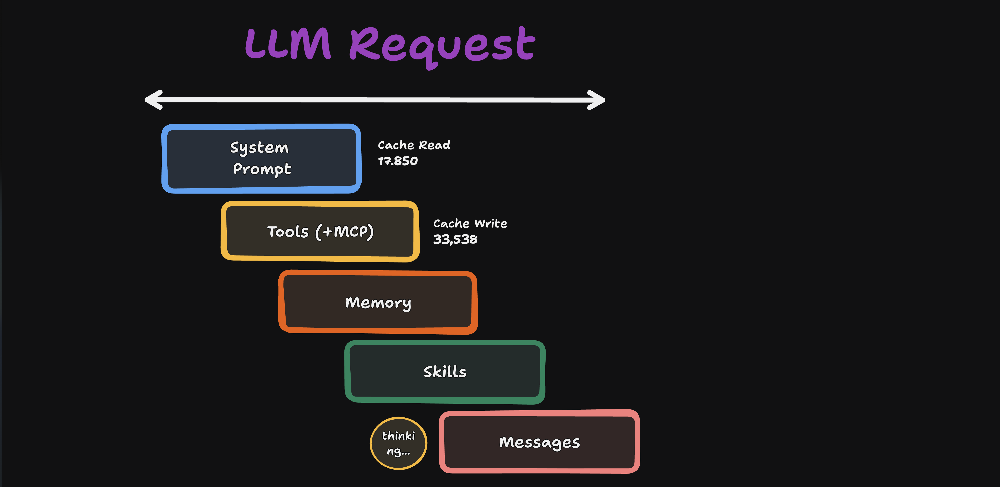

I'm using Claude Code as the example here, but this applies to pretty much any provider or coding agent. One thing before we start: I'll be using "Claude Code" and "the user" interchangeably, because Claude Code is running on the client. From the API's point of view, the "user" isn't just what you type — it's also everything Claude Code sends back on your behalf, like tool results. On the other side we have the Anthropic server, which is actually the LLM — Opus in this case, because we'll be using Opus 4.8.

The whole conversation between Claude Code and the Anthropic server is built from the 5 building blocks above, but they are not sent over raw. There is a bit of massaging that Claude Code does to pick only the most important things to send as part of the context, so it doesn't pollute the context window too much. 

## The quota probe, and how I'm looking inside

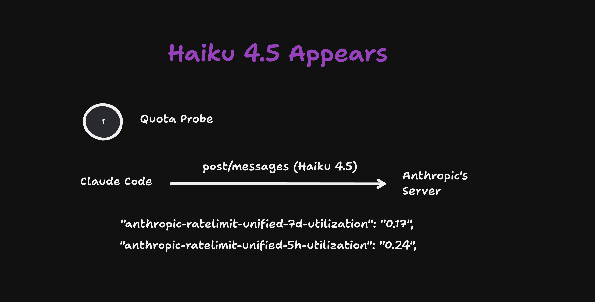

When you type `claude` in the terminal and Claude Code opens, there's a small request that fires before you even start talking to the agent. It's called the quota probe.

Claude Code is closed source, so we can't inspect the source code to understand what exactly happens. But what we *can* do is put a proxy in front of Claude Code — and that's what I did, so I can inspect every single request. This was possible thanks to an open source tool called [claude-tap](https://github.com/liaohch3/claude-tap) — shout-out to the guys behind it, amazing tool. I've modified it a bit for this video so it's easier to see what happens under the hood.

So: we open Claude Code, and before we've written anything, turn one appears — and it's a Haiku 4.5 model, even though we started Claude Code with Opus 4.8. That's the quota probe. Anthropic uses a cheaper model to probe their servers and return the exact quota you have remaining — how much usage is left for the next five hours and for the next week. The response carries headers like this:

```text
anthropic-ratelimit-unified-7d-utilization: 0.17
```

0.17 means I've used 17% — I have 83% of my weekly quota remaining at this exact moment in time. (If you click turn one and check the full JSON in my capture, the 7-day utilization is actually at zero, because Anthropic had just reset the rate limits for everyone.) Apart from that, not much going on in this request itself.

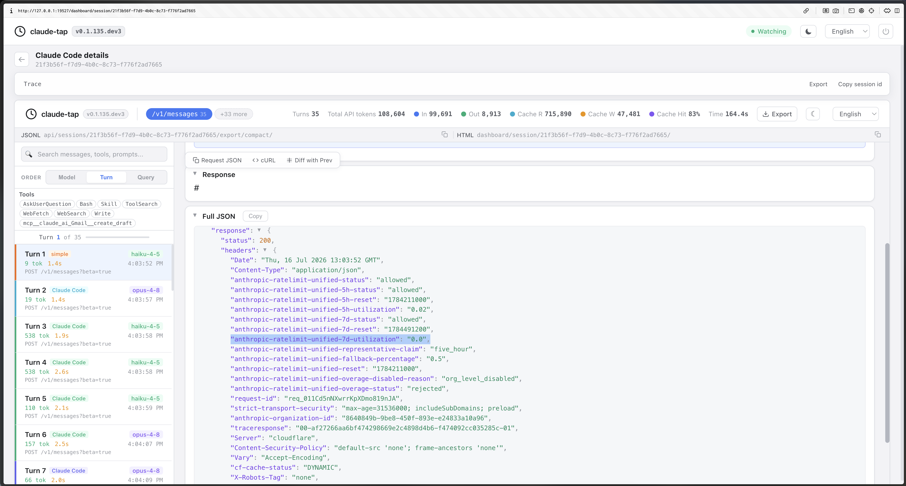

## The first real message

My first actual request to Claude Code was:

> Reply exactly: LETS_PLAN_A_TRIP

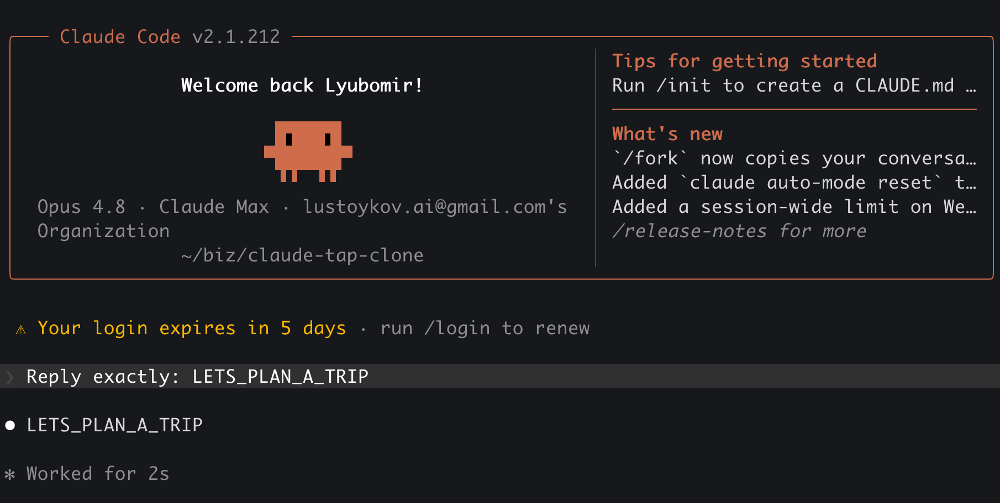

And Claude Code replied with `LETS_PLAN_A_TRIP`, as requested. That's turn two. Looking at turn two in the proxy is a bit overwhelming at first, so let's go through it conceptually first.

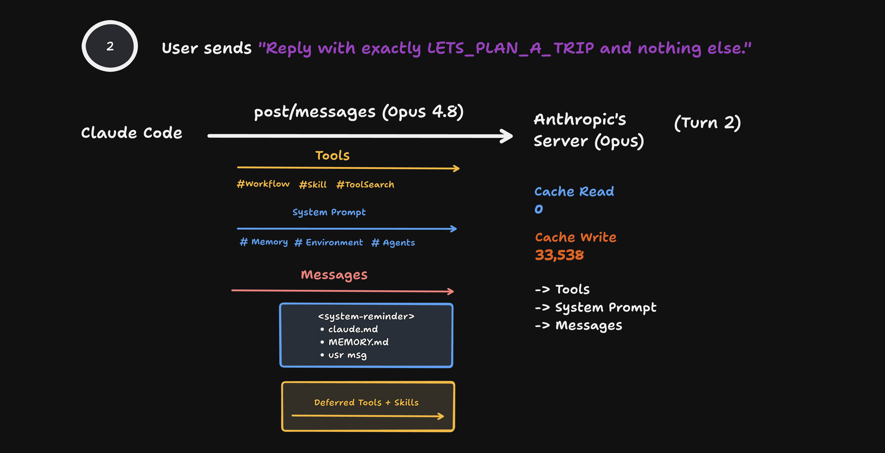

As a user, I sent "reply exactly LETS_PLAN_A_TRIP" and nothing else. What went out was a POST request to `/v1/messages` on the Anthropic server, and it included a lot more than my one sentence.

**The tools.** The request carries the full definitions of the tools Claude Code ships by default — name, description, and an input schema that tells the model what arguments it can pass. The important ones: the Workflow tool, which spawns dynamic workflows in Claude Code; the Skill tool, super important — it's used to load skills, and we'll see exactly how in a minute; and ToolSearch, which is used to load deferred tools. There's also Read, Edit, Write, Bash, and so on.

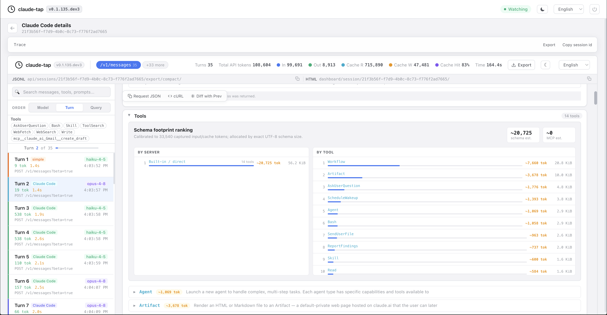

I modified claude-tap to sort the tools by number of tokens, and the heaviest tool is actually the Workflow tool. If you don't use the dynamic workflow feature, you can disable it in settings.json and decrease your context usage.

And it's very cool to inspect the tools like this, because you understand exactly what happens under the hood. There is no magic here. Nothing is hidden. We see exactly what is being sent to the server and what we get back.

**The system prompt.** This just includes instructions for the coding agent — how to behave — alongside information such as where exactly memory is to be found. It also includes all the skills we have installed — but only their names and descriptions, not the full skills. That's why the Skill tool exists: to load the full definition of a skill when it's needed.

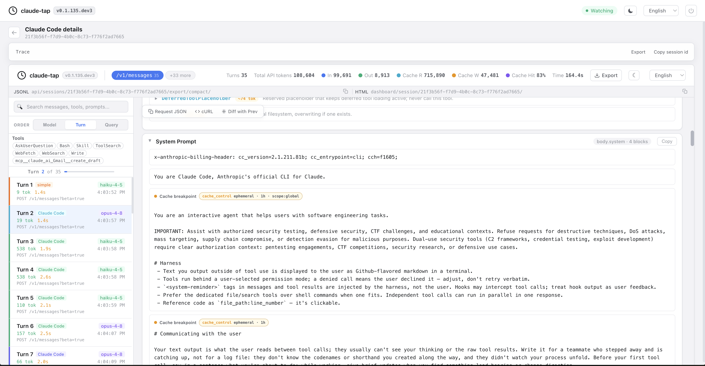

**The messages.** The messages include the conversation history, but they include quite a bit more, especially the first message. There's this system reminder that Claude Code sneaks into the first user message. In this exact turn-two capture, it carries the contents of `CLAUDE.md`, the user email, and the current date. There is no `MEMORY.md` yet, because this project doesn't have a memory directory until the last example in the video creates one. Once it exists, `MEMORY.md` works as a reference file — an index of the individual memories for the project — so Claude Code can load the index rather than dumping every memory into every request. And only after that injected context does my actual message follow.

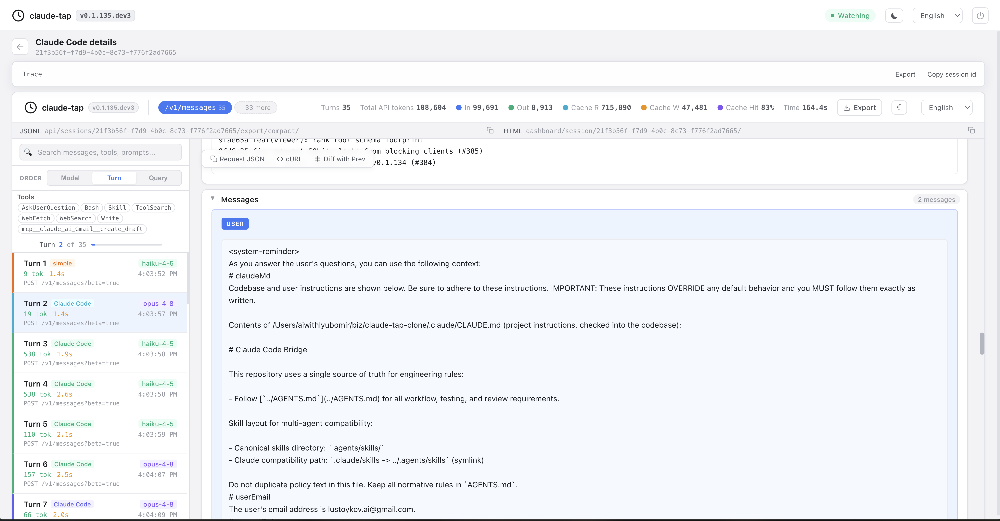
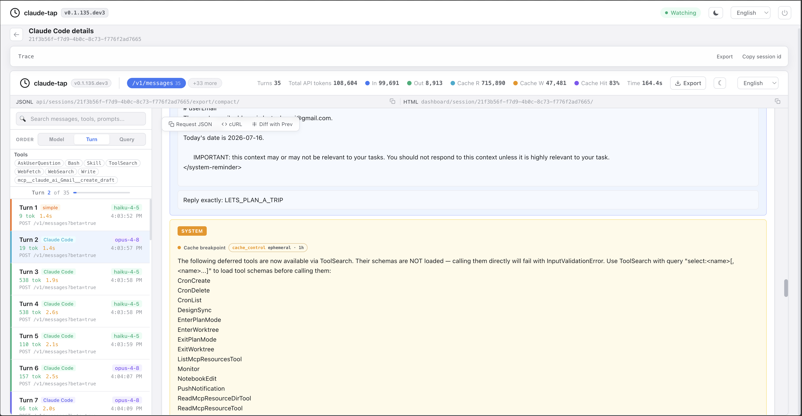
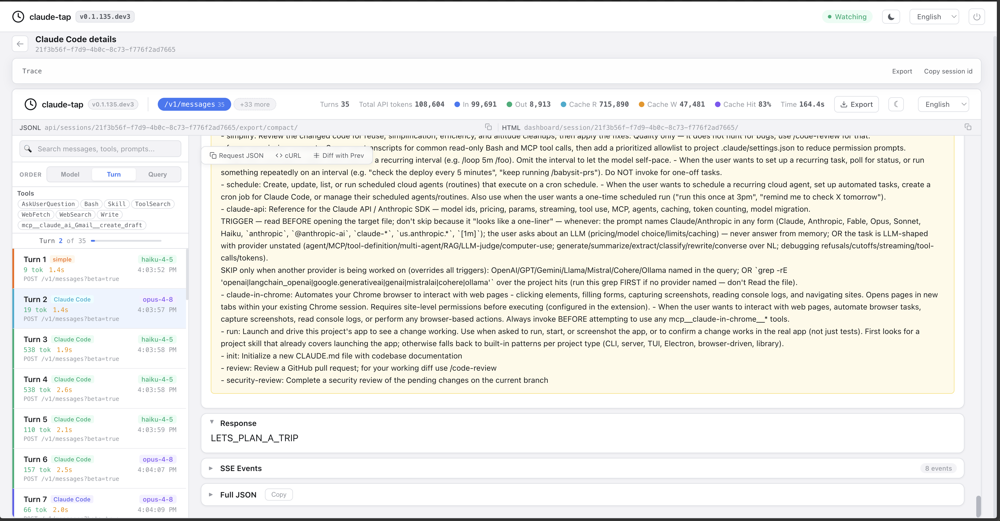

Trimmed down — and with the personal value removed — the first `messages` array really has this shape:

```json
[
  {
    "role": "user",
    "content": [
      {
        "type": "text",
        "text": "<system-reminder>CLAUDE.md + user email + current date</system-reminder>"
      },
      {
        "type": "text",
        "text": "Reply exactly: LETS_PLAN_A_TRIP"
      }
    ]
  },
  {
    "role": "system",
    "content": [
      {
        "type": "text",
        "text": "The following deferred tools are now available via ToolSearch..."
      }
    ]
  }
]
```

**The deferred tools.** This is the pattern I find the most interesting. The tools loaded on startup are the essential ones — but Claude Code has way more tools than that, especially once MCP servers come in. In the first user message there's a system block listing them by name: CronCreate, CronDelete, CronList, RemoteTrigger, WebSearch, the claude-in-chrome browser tools, computer use, and so on. If we were to include the full schemas of all of those in the initial context window, they'd occupy at least 100k tokens. That's almost half the context window. So Anthropic only sends the *names* of the non-essential tools, and gives the LLM the capability to load any of them on demand — via ToolSearch. Progressive disclosure, and it's minimizing the context window pollution.

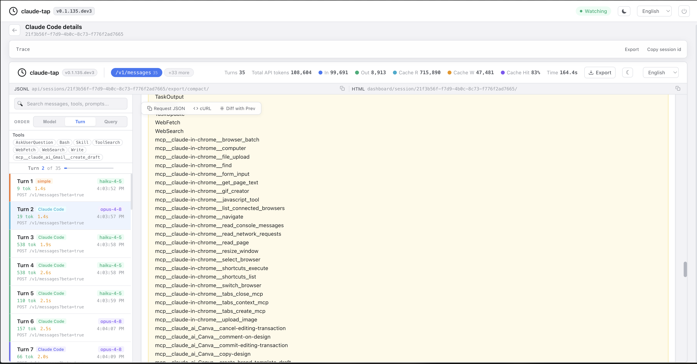

The relevant system block in the request says this — I've shortened the long list of names in the middle:

```text
The following deferred tools are now available via ToolSearch.
Their schemas are NOT loaded — calling them directly will fail with
InputValidationError.

Use ToolSearch with query "select:<name>[,<name>...]" to load tool schemas
before calling them: ... WebFetch WebSearch ...
```

So even for a tiny prompt like the one I sent, the real request is a much bigger: tools, system prompt, injected context, deferred tool names, and then finally the message.

## The cache, revisited

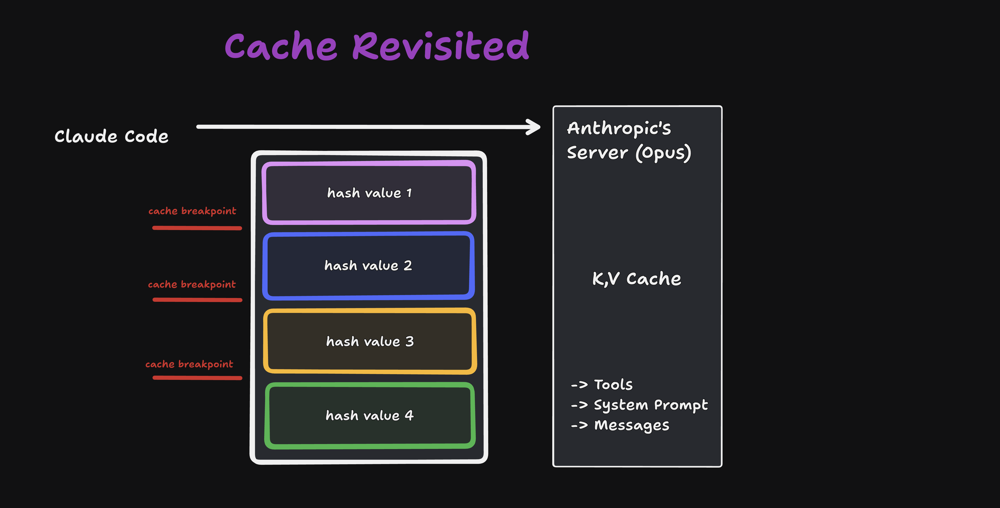

On this very first message — turn two — we have zero cache reads and 33,000 tokens of cache created. Let's revisit How LLM's Cache works:

LLMs are stateless. Whenever Claude Code sends a request to the Anthropic server, the whole chat history is sent again, on every turn. We send a huge amount of text to the LLM, it computes the attention scores for every single token in order to predict the next token — and on the next turn, we'd do the same thing again. It's just too much. So instead, we take this big block of text and we cache the attention scores. Next time we send the big block, the LLM doesn't have to compute the attention score for every single token — it already has them pre-computed in the cache, and it can get on with calculating the next token.

Of course, it's a bit more involved than that. The whole chunk of text is split into several blocks, and every block is marked by a cache breakpoint — essentially a cache boundary. When the big request arrives, the server takes the first block, before the first breakpoint, and looks in its cache. If it finds hash value one for that block, it takes the attention scores from the cache and moves on to the next block. Then it looks for hash value two, finds it, moves on to hash value three. And let's say hash value three is *not* found, because that chunk of text has changed — different content, different hash, cache miss. Everything after that block has to be recomputed.

That's exactly why the breakpoints make sense. If there were no cache breakpoints, one change would invalidate the whole request. With them, we only invalidate everything after hash value three. And that's why there are breakpoints after the tools, after the system prompt, and after every message — there's a hierarchy to it, because the things at the top change the least, and they're the least likely to bust the cache. Tools first, then system prompt, then messages.

You can see this in the raw JSON of turn two:

```json
"cache_control": { "type": "ephemeral", "ttl": "1h" }
```

Ephemeral, time-to-live one hour — in one hour the cache gets evicted. There are markers like this all over the request. You don't need to memorize where each one sits; I just want you to know they exist and roughly how the cache works.

## Skill use flow

Next step: I'd like to plan a day trip using a skill. I say:

> Use the day-trip-picker skill to choose one destination for a Saturday day trip from Sofia.

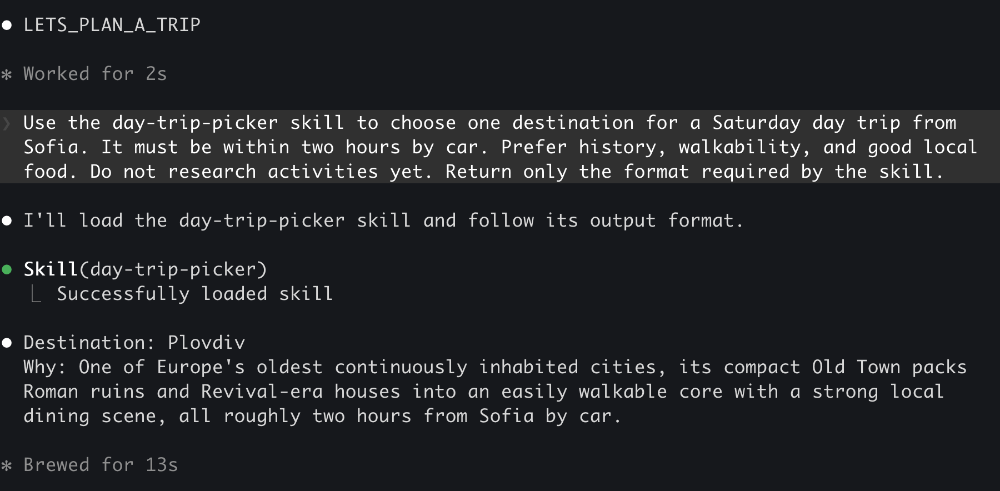

Sofia is the capital of Bulgaria, by the way. Let's see what happens on a high level first, and then look at the exact requests.

I told Claude Code I want the day-trip-picker skill. The LLM figures out, from the skill descriptions in the request, that this skill exists. It also knows it has access to the Skill tool — and what does the Skill tool do? It invokes a skill to get its full contents. So the LLM returns back to Claude Code and says: "Hey, can you load this skill, day-trip-picker, with the following arguments?" Claude Code invokes the Skill tool, loads the contents of the skill, and tells the LLM: here are the skill contents, and here are the arguments.

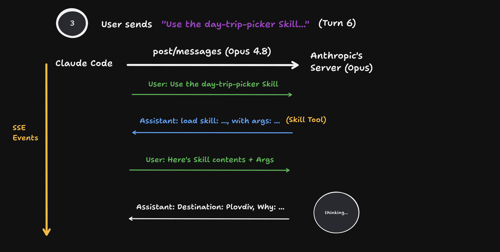

In the trace this is turn six. The response to my message is a JSON that asks Claude Code to use the skill:

```json
{
  "type": "tool_use",
  "name": "Skill",
  "input": {
    "skill": "day-trip-picker",
    "args": "Origin: Sofia. Saturday day trip, within 2 hours by car. Prefer history, walkability, good local food. Pick destination only — no activity research."
  }
}
```

There is no magic. Everything is just back and forth — responses and coordination between Claude Code and the LLM.

Here are also the full contents of the skill that Claude Code loaded:

````markdown
# Day Trip Picker

Choose exactly one destination using general knowledge only.

- Respect the stated origin, maximum travel time, and transport mode.
- Prioritize the user's interests.
- Do not call tools, search the web, inspect files, or claim current opening hours or availability.
- Keep the choice provisional until a later research step verifies current details.

Return exactly:

```text
Destination: <place>
Why: <one sentence>
```
````

And this was the output:

> **Destination:** Plovdiv
> **Why:** About two hours from Sofia, its Old Town packs Roman ruins and revival-era houses into a compact, walkable core with a strong local food scene.

Note: the full skill was never sitting in the system prompt. The model saw a one-line description, decided the skill was relevant, asked Claude Code to load it, got the full instructions back as a message, and followed them.

## Tool use flow

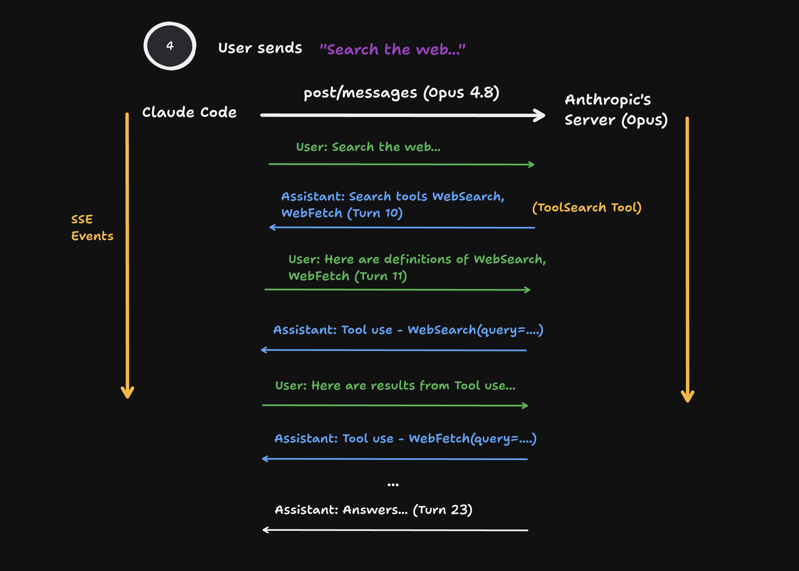

To understand the full picture, we also need to understand how tool use actually works. I type into Claude Code:

> Search the web for two activities at the destination you just selected.

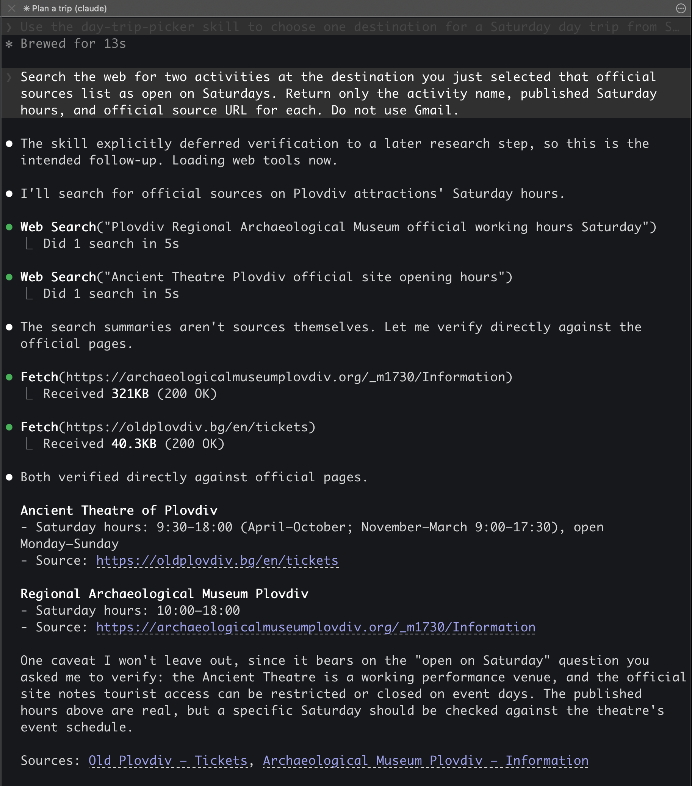

So I'd like to do two activities in the city Opus suggested. Opus, based on the request, sees that WebSearch and WebFetch tools exist (from the System Prompt) — but they're deferred, so it only knows their names. It also sees it has ToolSearch. So first, it asks Claude Code to run ToolSearch for WebSearch and WebFetch. Claude Code returns their full definitions — this happens on turn 11 in my capture. If you copy the full request-response JSON, paste it in Cursor and search for WebSearch, you find the exact definition: a description ("searches the web") and an input schema — the query, allowed domains, and the other arguments the LLM can pass.

The loaded WebSearch schema is just ordinary JSON Schema. This is the exact `input_schema` from turn 11:

```json
{
  "$schema": "https://json-schema.org/draft/2020-12/schema",
  "type": "object",
  "properties": {
    "query": {
      "description": "The search query to use",
      "type": "string",
      "minLength": 2
    },
    "allowed_domains": {
      "description": "Only include search results from these domains",
      "type": "array",
      "items": { "type": "string" }
    },
    "blocked_domains": {
      "description": "Never include search results from these domains",
      "type": "array",
      "items": { "type": "string" }
    }
  },
  "required": ["query"],
  "additionalProperties": false
}
```

And this is the exact ToolSearch call that loaded WebSearch and WebFetch:

```json
{
  "name": "ToolSearch",
  "input": {
    "query": "select:WebSearch,WebFetch",
    "max_results": 2
  }
}
```

Here is the same moment in the recording: the newly loaded WebSearch schema is on the left, and the search/fetch calls Claude Code executed are on the right.

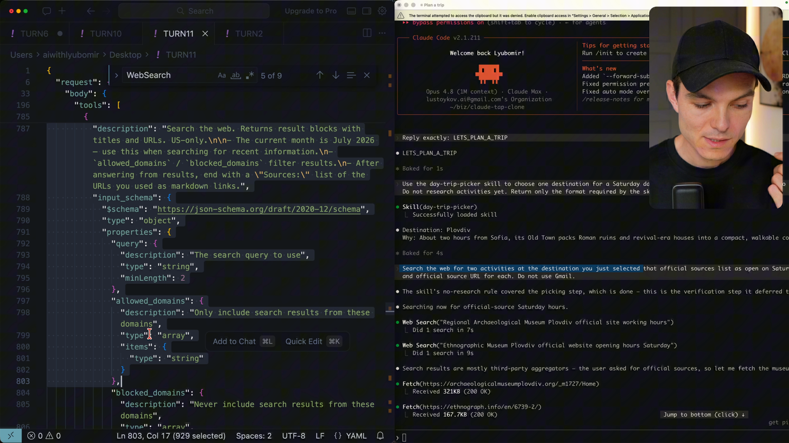

By turn 14, if we inspect the tools in the request, WebSearch and WebFetch are right there — the LLM has loaded them. And now the back-and-forth begins:

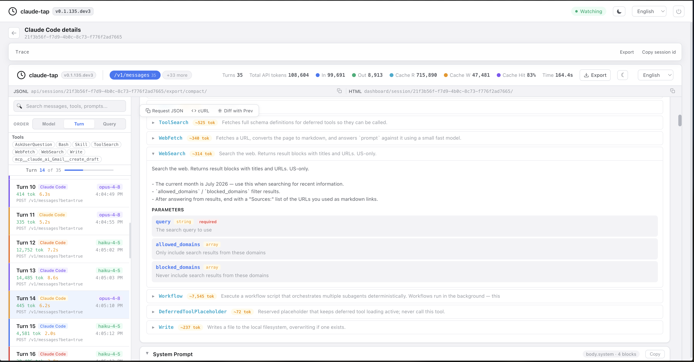

The assistant asks Claude Code to execute two web searches with its queries. Claude Code actually runs those searches and returns the results. And then the LLM responds with something I love:

> Search results are mostly third-party aggregators — let me fetch the museums' own sites.

So it asks Claude Code to use WebFetch, this time with a URL and a prompt. You can guess what happens on the next turns: the user — Claude Code — answers with the results from those fetches, the LLM looks at them, goes back and forth a bit, executes more fetches, and when it has searched and fetched enough, it summarizes everything and finally answers, on turn 23:

> Both verified from the venues' own sites, not aggregators.

...followed by the full suggestion with the two activities and their Saturday opening hours.

The full flow, summarized: the user asks the LLM for something. The LLM recognizes it needs a tool. It asks for the full definition of the tool. The user returns the definition. Now the LLM knows how to use the tool, so it asks the user to run it. The user runs it and passes back the response. The LLM does its crunching and thinking, maybe requests a few more tool calls, and once it has gathered enough information, it summarizes and finally answers.

Note that the tool never runs inside the LLM. The LLM only produces structured output asking Claude Code to run it. Claude Code executes, and the result comes back in the next request.

And by this point we can see the cache breakpoints doing their job: a lot of cache reads, some cache writes, and a lot of cache hits — the stable prefix is reused while the new tool results get appended.

## MCP (deferred) tool use

I'll go very quickly through the last two examples, because the pattern is pretty much exactly the same.

I ask the LLM to create a Gmail draft. By the way — at this point, on every single turn, I need to scroll again through the exact same history, which is getting longer and longer. This is what we mean when we say LLMs are stateless.

My prompt was: create an unsent Gmail draft with no recipients. I confused the LLM a bit here, because later in the same message I said: as recipient, use my email. The LLM recognized the contradiction and told me: "Your message asks for two incompatible things." Then it asked Claude Code to use the AskUserQuestion tool to ask me: would you like no recipients, or a recipient after all? The result of that tool went back to the LLM, and now it knows what to do.

The Gmail create-draft tool is an MCP tool, and it starts as a deferred tool. In the deferred list, the LLM finds the name `mcp__claude_ai_Gmail__create_draft`, and invokes ToolSearch with that exact name to get the full definition. Claude Code responds, the LLM loads the definition into its context, and in the next step Opus asks Claude Code to invoke create_draft with the arguments — recipient, subject, body. The tool is invoked, the draft is created, and the assistant answers: draft created.

This was the schema-loading request:

```json
{
  "name": "ToolSearch",
  "input": {
    "query": "select:mcp__claude_ai_Gmail__create_draft",
    "max_results": 1
  }
}
```

Claude Code returns a `tool_reference` for that tool. On the next turn, Opus can finally produce the real MCP call. This is the payload shape, with my address redacted and the email body shortened:

```json
{
  "name": "mcp__claude_ai_Gmail__create_draft",
  "input": {
    "to": ["[my email]"],
    "subject": "Saturday day trip",
    "body": "Hey! ... [the complete Plovdiv invitation]"
  }
}
```

The tool result contains the new draft ID, and the last model response is exactly:

```text
DRAFT_CREATED
r4859240861013108663
```

So, in the actual video trace, there is no failed create-draft call. Claude asked the clarification question first, I chose my address, and the first MCP call succeeded.

Same loop as before. MCP just changes where the tool comes from — it doesn't change the dance.

## Memory use breakdown

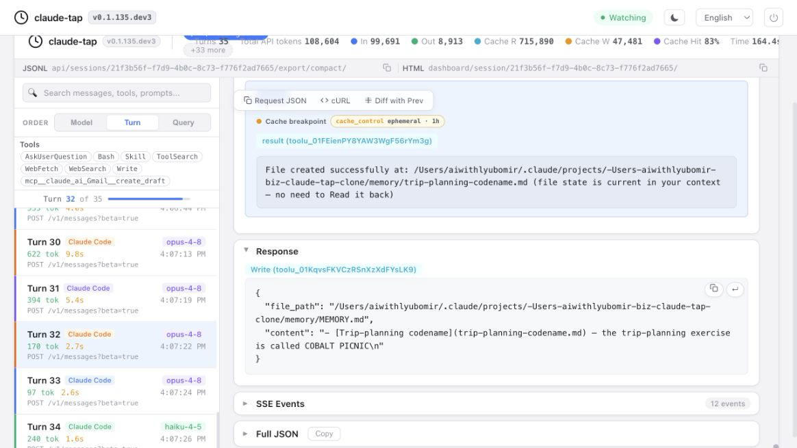

The last thing: how memory works. I say:

> Remember: the trip-planning codename is COBALT PICNIC. Save it into persistent memory.

The system prompt has already explained to the LLM how memory works and where it lives. So the LLM uses Bash to list all the memories in this specific project — "list existing memory files" — and the result is: no such file or directory. The LLM figures out the memory directory doesn't exist yet, so a write will create it. It calls another tool — the Write tool, one of those default tools Claude Code ships with — and writes the memory. The file is created successfully; in the trace you can see it wrote two files: the memory itself, and the `MEMORY.md` index that points to it. And the LLM responds: saved, the codename is remembered.

The trace is just this ordinary tool loop:

```text
Bash: list existing memory files
→ tool_result: no such file or directory
→ Write: create the individual memory file
→ Write: update MEMORY.md with a pointer to that file
→ assistant: Saved. The codename COBALT PICNIC is now in persistent memory.
```

And these are the two files the model actually asks Claude Code to write. The first file content is shortened here; the `MEMORY.md` line is complete:

```json
[
  {
    "name": "Write",
    "input": {
      "file_path": ".../memory/trip-planning-codename.md",
      "content": "The trip-planning codename is COBALT PICNIC. ..."
    }
  },
  {
    "name": "Write",
    "input": {
      "file_path": ".../memory/MEMORY.md",
      "content": "- [Trip-planning codename](trip-planning-codename.md) — the trip-planning exercise is called COBALT PICNIC\n"
    }
  }
]
```

So memory is not some hidden state inside the model. It's files on disk, managed by the client, written and read with ordinary tools — and injected into future requests via that `MEMORY.md` reference we saw at the beginning.

## Wrapping up

I hope this post was helpful and demystifies a bit the anatomy of an LLM request. It's not magic — it's just code, with a bit of intelligence from the LLM and some smart engineering from Anthropic to not pollute the context window.

With that — thanks a lot for reading, and see you next time.

---

*Diagrams from the video: [tldraw board](https://www.tldraw.com/f/V69Jfx2YvBI2695P68X3a?d=v25.-386.2301.1230.page)*
*The proxy/trace viewer: [claude-tap](https://github.com/liaohch3/claude-tap)*
