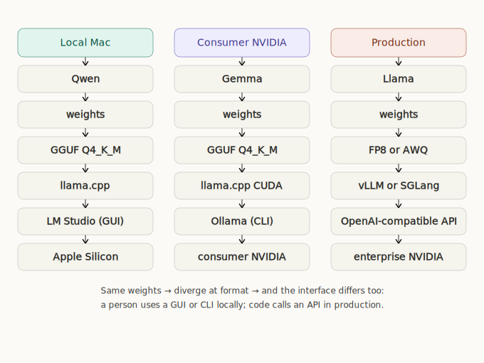
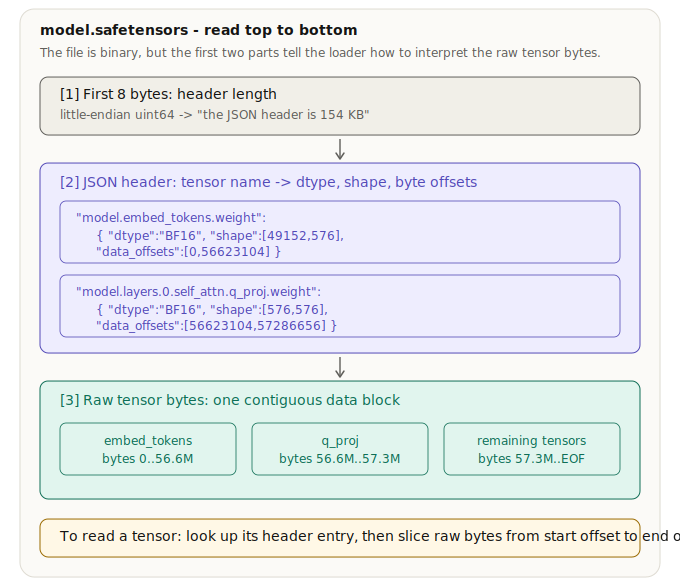
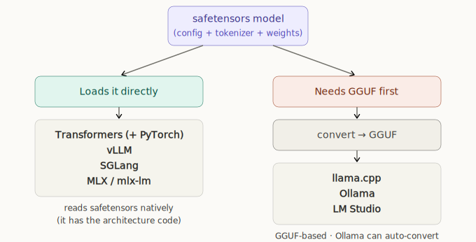
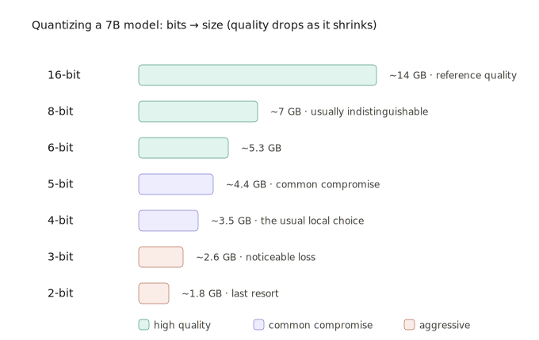
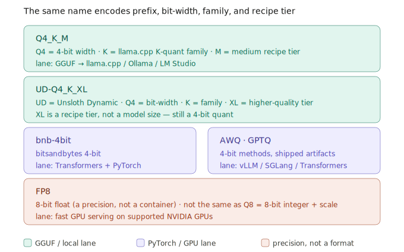

# The Lifecycle of a Local AI Model: A Beginner's Map

*A beginner's map to Hugging Face, Transformers, PyTorch, GGUF, safetensors, Ollama, LM Studio, Unsloth, MLX, vLLM, SGLang - and the rest of the vocabulary.*

I used to think local AI was mostly a hobby for rich people.

For the better part of last year, I kept seeing people tinker with local models. There was a level of obsession to it: spending $10-20K on GPUs, building clusters and running AI locally just to get performance that is worse than something you could get from OpenAI or Anthropic for $100/month.

But recently, open weight models have become smarter, cheaper, and faster, which made them very attractive choice for companies to self-host and also for invidividuals to run locally in some use cases. 

It seems like with this rate of progress, open weight models will eventually become good and small enough to be the default choice for many people. All this sparked my initial curiosity about local AI. 

However, there was a deeper reason I got interested: running your own AI forces you to understand AI deeply. If you only rent AI, all you have to do is write prompts. It's great for a lot of users as it hides the complexity underneath, but... as an engineer and someone who wants to innovate, this complexity and internal workings of AI is the part I'm interested in.

Local AI makes you deal with weights, tokenizers, file formats, memory, quantization, GPU backends, runtime engines, chat templates, KV cache, batching, and serving systems. This is still a young field. The tooling is rough, the abstractions are unstable, and a lot of the infrastructure hasn't settled. 

Understanding AI at this level gives you a better shot at seeing where the field is going - building the tools, starting a company and becoming an engineer who can program *with* AI and also program the AI system itself.

The problem was that the ecosystem and vocabulary was super confusing for me when starting with terminology like:

> Transformers, PyTorch, CUDA, safetensors, GGUF, Unsloth, LoRA, bitsandbytes, bnb-4bit, llama.cpp, Ollama, LM Studio, MLX, oMLX, vLLM, SGLang, AWQ, GPTQ, FP8, Q4_K_M, UD-Q4_K_XL.

So in this article, I want to break down all the complex terminology, look at the lifecycle of an LLM end to end and create a map to understanding Local AI.


## The Layer Map

A big source of confusion is that the confusing terms live at **different layers of the stack**. But once we separate these layers, things start looking easier.

| Layer | Examples | What it means |
|---|---|---|
| Model architecture | Llama, Qwen, Gemma, Mistral | The network design: layer count, attention pattern, hidden size, vocab size. |
| Weights | learned tensors | The actual learned numbers - the model's behavior encoded as matrices. |
| Tokenizer + chat template | tokenizer.json, tokenizer_config.json | How text becomes token IDs, and how chat messages become the exact prompt the model expects. |
| Storage format | safetensors, GGUF, MLX repo | How weights and metadata are stored on disk. |
| Precision / quantization | BF16, FP16, Q4_K_M, bnb-4bit, AWQ, GPTQ, FP8 | How many bits are used to store or compute the numbers. |
| Runtime / framework | Transformers, llama.cpp, MLX, vLLM, SGLang | The software that loads the model and runs inference. |
| Wrapper / app / server | LM Studio, Ollama, oMLX | A friendlier UI, daemon, CLI, or API around the runtime. |
| Preparation / optimization tooling | Unsloth, PEFT, Axolotl, LLaMA-Factory | Tools for fine-tuning, quantizing, exporting, or otherwise preparing a model. |
| Hardware | Apple Silicon, consumer NVIDIA, enterprise NVIDIA | Where the computation physically happens. |


### Three Paths

Saying "I’m running Qwen locally" doesn't paint the full picture. To know what that actually means, we need to specify: which Qwen, which weights, which tokenizer and chat template, which file format, which quantization, which runtime, which app, and which hardware. Here are three different ways to run Qwen - on a MacBook, Consumer Nvidia (RTX, DGX...), Production (H100, H200, B200...)



## The Lifecycle of AI

The layer map above told you **what pieces** exist in a running model. The lifecycle tells you **when** those pieces are created.

A lab releases one base model. From that single set of weights, the community produces a whole family of artifacts: they fine-tune it, convert it to GGUF, quantize that GGUF into smaller variants, export an MLX build for Apple Silicon, or prepare AWQ versions for GPU serving. 

So the same Qwen3 ends up existing simultaneously as a safetensors repo, as GGUF quants, as an MLX build, and as an AWQ artifact. Each then gets run by whatever fits: GGUF by llama.cpp, AWQ by vLLM, and so on. 

Later in the article we'll share a glossary that clarifies which artifact can be run by which runtime on which hardware, but let's first look at the different stages in the lifecycle of AI:

| Stage | Done by | Output |
|---|---|---|
| Pretraining | lab | architecture, tokenizer, base weights |
| Post-training | lab | instruct weights, chat behavior, chat template |
| Release | lab / publisher | Hugging Face repo (safetensors + config + tokenizer) |
| Convert | community / you | GGUF / MLX / serving artifacts |
| Quantize | community / you | Q4_K_M, Q5_K_M, AWQ, GPTQ, FP8 |
| Run | you / server | runtime + wrapper + hardware |


Next, we'll go through these stages one by one. We'll use one small model as the running example throughout - [`HuggingFaceTB/SmolLM2-135M-Instruct`](https://huggingface.co/HuggingFaceTB/SmolLM2-135M-Instruct)


### Pretraining: Architecture, Tokenizer, Base Weights

The lifecycle starts when a lab designs a model architecture and trains it on a large text corpus. An architecture is the model's design. A Llama-style architecture defines things like:

```json
{
  "model_type": "llama",
  "hidden_size": 576,
  "intermediate_size": 1536,
  "num_hidden_layers": 30,
  "num_attention_heads": 9,
  "num_key_value_heads": 3,
  "vocab_size": 49152
}
```

During pretraining, the lab feeds the model huge amounts of text and trains it to predict the next token. The result is a set of base weights. Weights are learned numbers arranged as tensors (multi-dimensional matrices) because the model works by multiplying vectors through weight matrices, and that shape is what the math requires.

In other words, in an LLM, the weights are matrices (numbers) are used to transform token IDs (that represent subwords) into internal representations and eventually into probabilities for the next token (next word prediction). 

The weights usually stored in a `safetensors` file in the model's repository on Hugging Face. For example, in the small model `HuggingFaceTB/SmolLM2-135M-Instruct`, one tensor (of weights) looks like this:

```
model.layers.0.self_attn.q_proj.weight   BF16   [576, 576]
```

Read that as: name `model.layers.0.self_attn.q_proj.weight`, type `BF16` (16-bit floating point), shape `576 × 576`. It's one of the attention matrices in the first layer, used every single time the model predicts a token. More on this in [the Hugging Face & safetensors section](#release-hugging-face-repos-and-safetensors).

The **tokenizer** is decided at this tep too. It maps text to token IDs and back:

```
"the cat sat on the mat"
→ [1820, 8415, 3842, 327, 260, 10437]
```

The model never sees English words. It sees token IDs, which are fed through the network, combined with the learned weights, and used to predict the next token (which is then again converted into a word loosely speaking).

So the result of pretraining isn't just "a model" in a vague sense. It is:

```
Architecture + Tokenizer + Base Weights
```

### Post-Training: Instruct Weights and Chat Templates

A base model is usually *not* the model you chat with.

After pretraining, labs often do **post-training**: supervised fine-tuning, preference optimization, reinforcement learning, tool-use training, safety training, instruction tuning, and other steps that make the model useful as an assistant. This produces a *new* set of weights with new behavior:

```
base weights     = good at continuing text
instruct weights = better at following instructions and chat formats
```

Post-training is also where the **chat format** becomes important. Modern instruct models are sensitive to the exact text structure they were trained on. A chat message like:

```json
[
  { "role": "system", "content": "You are helpful." },
  { "role": "user", "content": "Explain GGUF." }
]
```

has to be rendered into a plain-text prompt, for example:

```
<|im_start|>system
You are helpful.<|im_end|>
<|im_start|>user
Explain GGUF.<|im_end|>
<|im_start|>assistant
```

The model was trained on strings like that. If your runtime (like llama.cpp) formats the prompt differently, the *same weights* can behave worse - ignoring tools, refusing to stop, or answering in a strange style.

The chat template typically lives in tokenizer/config metadata - `tokenizer_config.json` in a Hugging Face repo, and `tokenizer.chat_template` after conversion to GGUF. So worth noting: weights, tokenizer, and chat template are separate pieces that all have to agree with each other.

### Release: Hugging Face Repos and safetensors

After training and post-training, the model is often released on Hugging Face.

For open models, **Hugging Face** has become the default distribution layer - a GitHub-like registry for model repositories, model cards, files, versions, etc. When people say "download the model from Hugging Face," they usually mean "download a model repo from the Hub," like [`HuggingFaceTB/SmolLM2-135M-Instruct`](https://huggingface.co/HuggingFaceTB/SmolLM2-135M-Instruct)

A typical repo might contain:

```
config.json
tokenizer.json
tokenizer_config.json
generation_config.json
special_tokens_map.json
model.safetensors
```

Larger models shard (split) the weights across files:

```
model-00001-of-00004.safetensors
model-00002-of-00004.safetensors
model-00003-of-00004.safetensors
model-00004-of-00004.safetensors
```

Those shards mean the weights are split across several files because the model is too large for one convenient file. Very roughly speaking, the number of weights a model has corresponds to the number of parameters. So a 1B parameter model has 1B weights, each 16 bits - that's ~2GB of weights. Current frontier models have closer to ~1T parameters, which is ~2TB (2000GB) weights storage (not the memory required to run it)

#### Why Hugging Face?

What Hugging Face standardized is the *conventions*: predictable files (config, tokenizer, generation config, weights), `config.json` describing which architecture class to build, `tokenizer.json` holding the tokenizer data, `safetensors` storing tensors safely and efficiently, and common loader APIs like `AutoModelForCausalLM.from_pretrained(...)`. 

That doesn't mean every model runs everywhere - a runtime still has to support the architecture, tokenizer, and quantization - but the Hub conventions are what let so many tools interoperate. 

### What's Inside Those Files

Let's make the repo concrete with the running example, `HuggingFaceTB/SmolLM2-135M-Instruct`. This model is useful here because it's small, legit, non-gated, and easy to inspect.

**config.json** describes the architecture - think of it as the blueprint before the house is built:

```json
{
  "model_type": "llama",
  "architectures": ["LlamaForCausalLM"],
  "torch_dtype": "bfloat16",
  "hidden_size": 576,
  "intermediate_size": 1536,
  "num_hidden_layers": 30,
  "num_attention_heads": 9,
  "num_key_value_heads": 3,
  "vocab_size": 49152
}
```

This file contains no learned weights. It tells the runtime what structure to build before loading them - 30 layers of 576-wide matrices with a 49,152-token vocabulary.

**model.safetensors** contains actual learned numbers (weights). The file has three parts in order - an 8-byte header length, then a JSON header (a dictionary mapping each tensor name to its dtype, shape, and byte offsets), then one contiguous block of raw weight bytes.

The three header fields work together as a lookup. To load `q_proj`, a library reads the header, finds that entry, sees `dtype: BF16` and `shape: [576, 576]` (so it knows to build a 576×576 bfloat16 matrix), and reads its `data_offsets` - the start and end byte positions in the data block. It slices exactly those bytes and reshapes them into the matrix. The dtype says *how to interpret* each group of bytes, the shape says *how to fold the flat bytes into a grid*, and the offsets say *where to cut*.



From the demo, a few of those entries:

```
model.embed_tokens.weight                 BF16   [49152, 576]
model.layers.0.self_attn.q_proj.weight     BF16   [576, 576]
model.layers.0.self_attn.k_proj.weight     BF16   [192, 576]
model.layers.0.mlp.up_proj.weight          BF16   [1536, 576]
```

`BF16` means bfloat16, a 16-bit float. Weights usually don't need full 32-bit precision, and BF16 roughly halves storage versus FP32 while keeping a wide numeric range. One tensor makes the point:

```
49152 × 576 = 28,311,552 numbers
BF16:  28,311,552 × 2 bytes ≈ 56.6 MB
FP32:  28,311,552 × 4 bytes ≈ 113.2 MB
```

That's a single tensor - `[49152, 576] × 2 bytes` is the `embed_tokens` block, which matches the `[0, 56623104]` offsets a loader would read for it. Across the whole model, FP32 would roughly double the weight size. For completeness, `embed_tokens` represents the embedding table that maps token id to its vector (numerical representation).

You don't need to understand all the math here, just know that the header in `.safetensors` file contains metainformation about where to find the necessary tensors.

**tokenizer.json** Tokenization is an algorithm, but the implementation lives in a library (Hugging Face Tokenizers, Transformers, SentencePiece, or a runtime's own code). This JSON stores the *data* that implementation needs: the vocabulary, merge rules, special tokens, and normalizer/pre-tokenizer/decoder settings. It holds the rule that turns `" cat"` into a specific token ID - the dictionary that converts text into the integers the model actually consumes. For SmolLM2 it's BPE-like with 49,152 tokens.

**tokenizer_config.json** contains higher-level settings like `bos_token`, `eos_token`, `pad_token`, `tokenizer_class`, and the all-important `chat_template`. Where `tokenizer.json` knows the words, this file knows the conventions: when a turn ends, and how to wrap a system + user message into the exact string the model expects.

**generation_config.json** is the default settings like - `temperature`, `top_p`, max length, and the special token IDs, used when you don't specify your own.

## Convert and Quantize: From Released to Runnable

A released model is rarely used exactly as published. Three different things happen to it before running.

- **Conversion** changes the *packaging* (for example, safetensors → GGUF).
- **Quantization** changes the *numeric precision* and memory footprint (for example, 16-bit → 4-bit).
- **Fine-tuning** changes the *behavior* (training on new data).

And for most people running models locally, the important path isn't fine-tuning at all. It's *convert, then quantize, then run*. So we'll take those in that order.

### Convert: Why GGUF Exists

Transformers (Python library / runtime) can read a Hugging Face repo out of the box, because it knows how to read `config.json`, build the model class, load the safetensors, load the tokenizer, apply the config, handle generation settings, and run through PyTorch. 

However, Transformers is heavy and most people would use llama.cpp - a different runtime, lighter weight, which needs a different packaging (GGUF).

**llama.cpp** is a portable C/C++ inference engine, originally built to run LLaMA-style models locally (including on CPUs) without the full Python/PyTorch stack. That design needs a different package.

**GGUF** exists so llama.cpp-style runtimes can load a model from one compact, runtime-friendly file. (It's the successor to the older GGML/GGMF/GGJT formats.) The key design goal is that the single file contains everything needed to load the model unambiguously. It's not a one-to-one repackaging of the HF files - the conversion reads across all of them and produces its own internal sections:

```
Hugging Face repo:              GGUF (one file):
  config.json                     header / version
  tokenizer.json                  architecture metadata
  tokenizer_config.json           tokenizer + chat template metadata
  generation_config.json          tensor table
  model.safetensors               tensor data (possibly quantized)
```

If we convert `HuggingFaceTB/SmolLM2-135M-Instruct` safetensors to GGUF, we get roughly the following artifacts:

```
model.safetensors      257 MB
F16 GGUF               258 MB
Q4_K_M GGUF            101 MB (4-bit Quantization)
```

This conversion step ([which can be done by a small Python script](https://github.com/ggml-org/llama.cpp/blob/master/convert_hf_to_gguf.py)) *repackages* safetensors to GGUF so llama.cpp can load it (the size drop comes from the quantization step, not the conversion). 



### Quantization: Why Q4_K_M Exists

Quantization is the process of storing a model's numbers with fewer bits.

A model is mostly weights. At BF16/FP16 each number is 2 bytes; at FP32 it's 4. For a 7B-parameter model:

```
7B × 2 bytes ≈ 14 GB  (BF16 / FP16)
7B × 4 bytes ≈ 28 GB  (FP32)
```

That is *before* KV cache, runtime overhead, and other buffers. Quantization shrinks this by storing numbers in fewer bits, trading a little precision for a lot of memory:

```
16-bit → high quality, biggest
 8-bit → smaller, usually very strong
 6-bit → smaller
 5-bit → common quality/size compromise
 4-bit → very common local-inference compromise
 3-bit → aggressive
 2-bit → very aggressive
```



Under the hood, quantization takes numbers like 0.4271983 and stores them less precisely, say 0.43. That's why a 4-bit model is so much smaller. You trade memory for some loss of precision.

The quant *names* you see on Hugging Face are confusing because they don't all refer to the same kind of thing:

| Name | What it means | Runtime lane |
|---|---|---|
| `Q4_K_M` | llama.cpp GGUF K-quant, 4-bit class, medium recipe | GGUF → llama.cpp / Ollama / LM Studio |
| `UD-Q4_K_XL` | Unsloth Dynamic GGUF quant, 4-bit class, larger/higher-quality profile | GGUF → llama.cpp-style |
| `bnb-4bit` | bitsandbytes 4-bit loading | Transformers + bitsandbytes + PyTorch |
| `AWQ` | activation-aware weight quantization | GPU inference - vLLM / SGLang / Transformers |
| `GPTQ` | post-training weight quantization | GPU inference - vLLM / SGLang / Transformers |
| `FP8` | 8-bit floating-point precision | fast GPU serving (Hopper/Blackwell) |



### Small detour

A few traps to be aware of. `FP8` is a numeric *precision*, not a container format like GGUF or safetensors - you can store or compute tensors in FP8, but the model still needs a file format and a runtime. It's also easy to confuse with `Q8`: `FP8` is an 8-bit *float* (used on modern NVIDIA GPUs that do FP8 math natively), while `Q8_0` in the GGUF world is an 8-bit *integer* plus a scale factor per block. Both use 8 bits per weight; the encoding and the lane differ. `AWQ` and `GPTQ` are not the same kind of name as `Q4_K_M`; they're quantization *methods* and artifact families used in GPU serving. 

The two are close cousins - both are post-training 4-bit methods you load in vLLM, SGLang, or Transformers (Enterprise / Heavy grade) - with one difference worth knowing: AWQ protects the small fraction of "salient" weights that handle the largest activations, which tends to give it a quality edge over GPTQ at the same bit-width. 

Finally, `bnb-4bit` is the bitsandbytes/Transformers path, **not** GGUF; and `Q4_K_M` is the GGUF/llama.cpp path.

**A note on "dynamic" quantization**, since it comes up next. The algorithms above don't have to compress every tensor the same way - some tensors are far more sensitive to compression than others. A simple quantization applies one broad setting; a **dynamic** quantization keeps more precision in the sensitive tensors and compresses harder where the model tolerates it:

```
generic quant:  apply one broad quantization algorithm
dynamic quant:  choose precision per tensor by sensitivity
```

That can give a better quality-to-size tradeoff - but a dynamic 4-bit quant is still a compressed model, not the original full-precision one. The best-known branded version of **dynamic quants is Unsloth**.

### What Is Unsloth?

Now that GGUF and quantization have been introduced, let's unpack Unsloth. It's a tooling company that helps people *prepare* models: fine-tune them, load them efficiently, quantize them, export them, and publish convenient variants. For a beginner, the most important thing Unsloth does is publish easier-to-run versions of models that someone else trained.

A useful way to hold it:

```
Qwen team   makes      Qwen
Meta        makes      Llama
Google      makes      Gemma
Mistral     makes      Mistral

Unsloth     publishes  optimized / quantized / fine-tuning-friendly variants
```

So when you see `unsloth/Qwen3-14B-GGUF`, read it as: base model **Qwen3** (the **14B** is the parameter count - that's the model's size, and it lives in the model name), prepared and published by **Unsloth**, in **GGUF** format, for local inference with llama.cpp-style tools.

The quant suffixes are a separate axis from model size, and `UD-Q4_K_XL` is worth decoding carefully: **UD** = Unsloth Dynamic, **Q4** = the bit-width (~4-bit - *this* is what sets the file size and precision), **K** = the llama.cpp K-quant family, **XL** = a quality/algorithm *tier*, not "extra-large model." 

As we already know, Unsloth isn't the only project doing this - llama.cpp has its own quantization tooling, and AutoGPTQ, AWQ, bitsandbytes, TensorRT-LLM, vLLM, SGLang, and MLX all live somewhere in the broader compression/inference world. 

Unsloth became visible, because it produces **high-quality, dynamic quants**.

### Where Fine-Tuning Fits

Fine-tuning is the side path - the one where you change a model's *behavior* rather than its packaging. You might take a base or instruct model and train it further on your support tickets, your coding style, your legal documents, or a structured task format.

For example, you might fine-tune an instruct model on your company's support conversations, internal coding style, or structured task format. The common efficient method is **LoRA**. Instead of retraining the model's billions of weights, you freeze them and train a small adapter alongside:

```
base model
→ train a small LoRA adapter
→ optionally merge the adapter into the base weights
→ optionally export / quantize the result
```

Unsloth is popular here too, because it makes LoRA fine-tuning dramatically cheaper on the Hugging Face / PyTorch stack - especially as **QLoRA**, where the frozen base is loaded in 4-bit (`bnb-4bit`, via bitsandbytes) while the small adapter trains in higher precision. That's what lets you fine-tune a sizable model on a single consumer GPU.

But for most people downloading local models, the first confusing thing isn't fine-tuning - it's the *artifact chaos*: GGUF, Q4_K_M, Q5_K_M, UD-Q4_K_XL, bnb-4bit, AWQ, GPTQ, FP8. 

So the right order is: **release → convert to GGUF → quantize → run locally → fine-tune later, only if you need to change behavior.**

## Running and Serving: From Your Laptop to Production

Up to this point we've built the model lifecycle from first principles - trained at a lab, released, converted, quantized. The rest of the article is more of an ecosystem map: which runtime to use, which artifact belongs where, and how to decode the names you'll see in the wild.

Everything so far has been about *files* - what's inside them, how they're packaged, how they're compressed. But a file just sits on disk. A **runtime** is the software that loads an artifact and actually executes inference and the runtimes form a spectrum. At one end: "I want to chat with a model on my laptop." At the other: "I'm serving thousands of requests a second to millions of users." Almost every runtime you'll hear about is a point on that line. Let's walk it from one end to the other.

**Transformers + PyTorch - flexible Python model runtime.** Transformers is the library that knows how to read a Hugging Face repo - build the architecture from `config.json`, load the safetensors, wire up the tokenizer, apply the chat template - and PyTorch is the tensor engine underneath that does the math. Together they're the most *flexible* thing in the ecosystem: you can inspect a model layer by layer, fine-tune it, write custom generation loops, debug a broken chat template, and plug in Unsloth, PEFT, and bitsandbytes. What they're *not* is the fastest way to serve many users at once. Transformers is the library where you take the model apart and put it back together.

**llama.cpp - portable GGUF inference runtime.** llama.cpp is the engine you can drop into almost anything. It's a C/C++ inference runtime built around GGUF, with no dependency on Python/PyTorch, and it runs across CPU, Apple Metal, NVIDIA CUDA, and Vulkan. That portability is, more than anything, *the* reason local AI took off on consumer hardware: it made running a model on a laptop - even a CPU-only one - genuinely feasible. The catch is the conversion step from the last section: llama.cpp doesn't read safetensors directly, so the path is always *HF repo → convert to GGUF → run*.

**Ollama cli - local model manager and API server** Once you have an engine, you still have to download models, store them, pick defaults, and expose them to your code. That's Ollama. It sits *above* the runtime as a daemon, CLI, and local API - `ollama run qwen` and you have the model running; `curl http://localhost:11434/api/chat` and you have a response. It's the layer that makes local models feel easy to use. 

**LM Studio - desktop app and local server.** Everything above assumes you're comfortable on the command line. LM Studio is for when you'd rather click. It's a desktop app and local server that can sit over *more than one* backend - llama.cpp for GGUF models, and MLX for Apple-Silicon-native ones - which makes it a comfortable base for exploring models, chatting locally, and spinning up an OpenAI-compatible endpoint without touching a terminal. It's an app and a wrapper.

**MLX and mlx-lm - Apple-native inference framework.** Everything so far works on a Mac through llama.cpp/Metal, but Apple has its own framework, MLX, built specifically for Apple Silicon and its unified memory, with mlx-lm as the LLM tooling on top. When an MLX build of the model you want exists, it's often the cleanest Mac-native path.

**oMLX - OpenAI-compatible server for MLX.** The same way Ollama wraps GGUF/llama.cpp models in a local API, oMLX wraps MLX-style models in one. It matters in one specific situation: you want Apple-native local inference, but your tools expect to talk to an OpenAI-compatible endpoint.

**vLLM - production serving runtime.** Cross from "I'm running a model" to "I'm running infrastructure" and the requirements start to differ. Now you care about throughput, many concurrent users, continuous batching, efficient KV-cache management, and squeezing every NVIDIA GPU. vLLM is the strong default here: point it at a Hugging Face repo and it serves an OpenAI-compatible API backed by serious GPU-utilization machinery. It's what you reach for when you need scale.

**SGLang - production serving for structured / prefix-heavy workloads.** SGLang lives in the same production-serving world and overlaps heavily, but its emphasis is different: structured generation, prefix reuse, agent loops, and tool-heavy prompts. The rule of thumb - if your mental model is "I need an efficient OpenAI-compatible API for a model," start with vLLM; if it's "I need high-throughput serving with lots of constrained outputs, reused prefixes, and agentic workflows," SGLang gets more interesting.


### Which Runtime Runs Which Format

Before the cheat sheet, here's the mapping that ties the whole formats discussion together - every format from earlier, and the runtimes that load it.

| Format | Loaded directly by | Lane |
|---|---|---|
| safetensors | Transformers, vLLM, SGLang, MLX | the original release format |
| GGUF (`Q4_K_M`, `UD-Q4_K_XL`, …) | llama.cpp, Ollama, LM Studio | local / portable |
| MLX repo | MLX, mlx-lm, LM Studio (Mac) | Apple-native |
| `AWQ` / `GPTQ` | vLLM, SGLang, Transformers (ExLlamaV2 for GPTQ) | GPU serving |
| `bnb-4bit` | Transformers + bitsandbytes | GPU, mainly fine-tuning |
| `FP8` | vLLM, SGLang (on supported NVIDIA GPUs) | GPU serving |


### The Runtime Cheat Sheet


| If you want… | Start with… |
|---|---|
| Local chat on a Mac | LM Studio, Ollama, or MLX via LM Studio |
| Maximum model availability locally | GGUF + llama.cpp / Ollama / LM Studio |
| A Mac-native Apple Silicon path | MLX / mlx-lm / the MLX backend in LM Studio |
| A local API for agents | Ollama or LM Studio server |
| Fine-tuning | Unsloth + Transformers + PEFT + PyTorch |
| Inspecting Hugging Face model files | Transformers / Python tooling |
| Production OpenAI-compatible serving | vLLM |
| Structured, prefix-heavy, agent-heavy serving | SGLang |
| Consumer NVIDIA experimentation | Transformers, Unsloth, llama.cpp CUDA, sometimes vLLM |
| Enterprise NVIDIA serving | vLLM, SGLang, TensorRT-LLM, TGI |


## One Model, Many Artifacts

The things to remember:

- **Conversion** changes packaging.
- **Quantization** changes numeric precision / memory footprint.
- **Fine-tuning** changes behavior.
- **Serving** changes how requests are scheduled and exposed.

## Follow Along: Inspect a Real Small Model

The most concrete way to learn this ecosystem is to open and inspect the files yourself. This article is based on `HuggingFaceTB/SmolLM2-135M-Instruct` and you can open codex / claude code and ask it to:

```
Clone the Hugging Face repo, then
→ inspect config / tokenizer / safetensors
→ convert to F16 GGUF
→ quantize to Q4_K_M
→ run with llama.cpp
```

The key files are `config.json`, `tokenizer.json`, `tokenizer_config.json`, and `model.safetensors`, plus the converted `smollm2-135m-instruct-f16.gguf` and `smollm2-135m-instruct-Q4_K_M.gguf`. The observed sizes:

```
model.safetensors  257 MB
F16 GGUF           258 MB
Q4_K_M GGUF        101 MB
```

Open the files, inspect the tables, convert the model, quantize it, and run it. 

## Sources

- Hugging Face Hub model docs - https://huggingface.co/docs/hub/en/models
- Hugging Face Transformers docs - https://huggingface.co/docs/transformers/index
- Hugging Face safetensors docs - https://huggingface.co/docs/safetensors/index
- Hugging Face bitsandbytes docs - https://huggingface.co/docs/transformers/en/quantization/bitsandbytes
- Hugging Face PEFT quantization docs - https://huggingface.co/docs/peft/developer_guides/quantization
- SmolLM2-135M-Instruct model card - https://huggingface.co/HuggingFaceTB/SmolLM2-135M-Instruct
- llama.cpp - https://github.com/ggml-org/llama.cpp
- GGUF specification - https://github.com/ggml-org/ggml/blob/master/docs/gguf.md
- MLX docs - https://ml-explore.github.io/mlx/build/html/index.html
- vLLM docs - https://docs.vllm.ai/
- SGLang docs - https://docs.sglang.io/
- Unsloth Dynamic GGUF docs - https://unsloth.ai/docs/basics/unsloth-dynamic-2.0-ggufs
